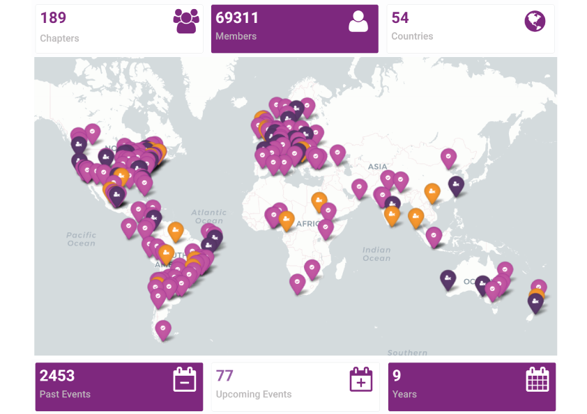
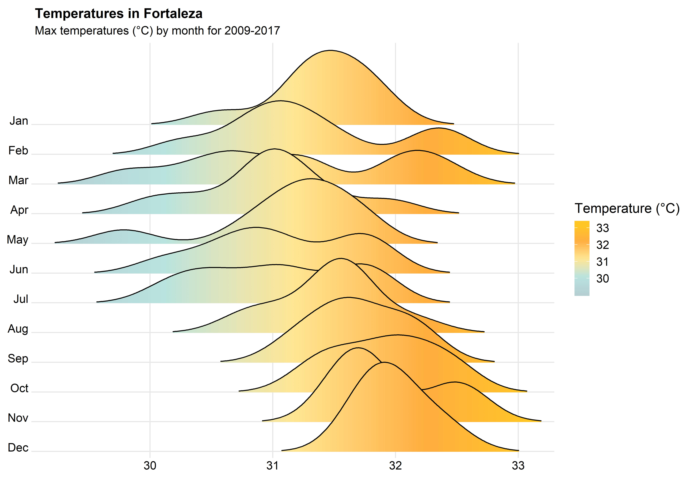
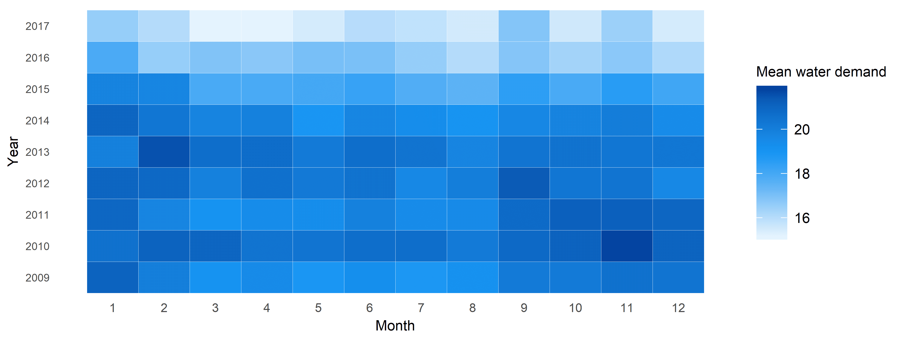
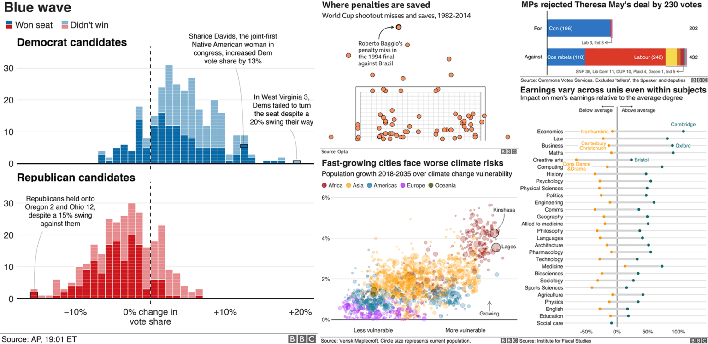
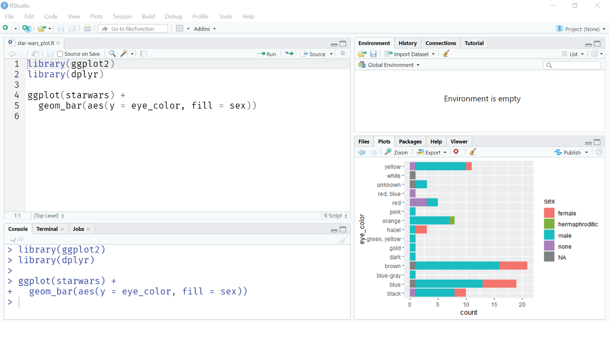
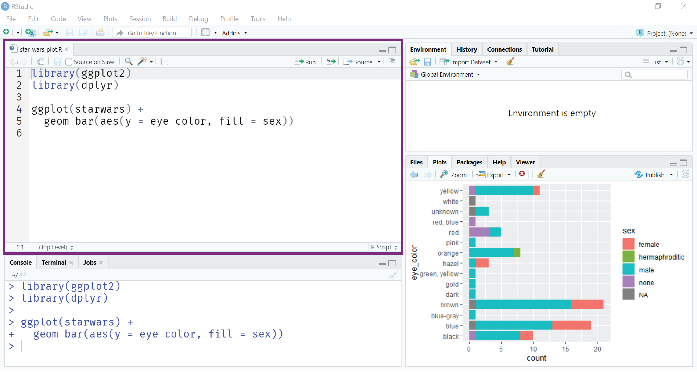
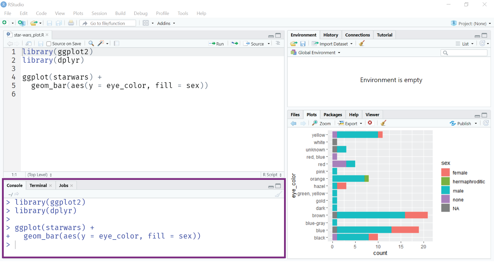
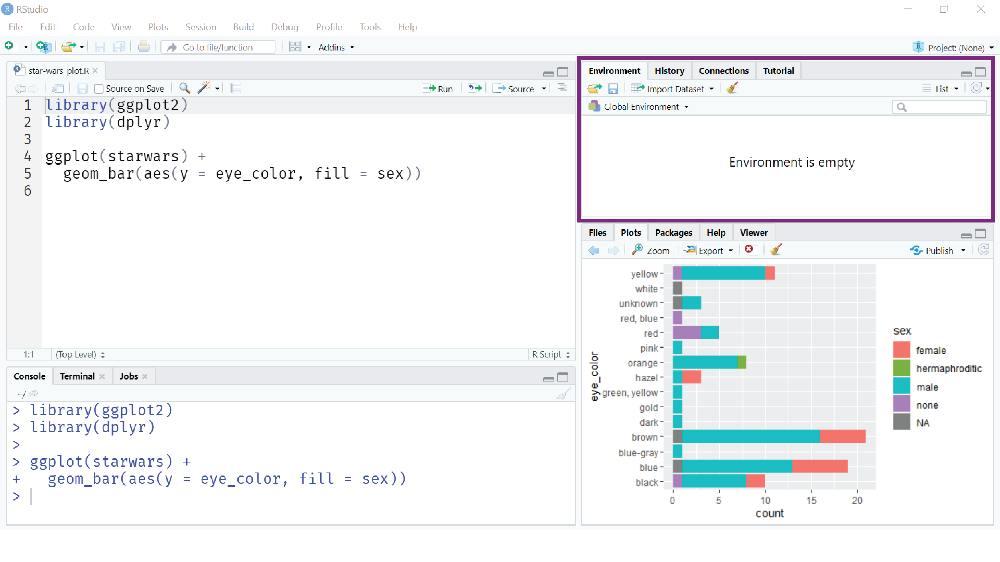
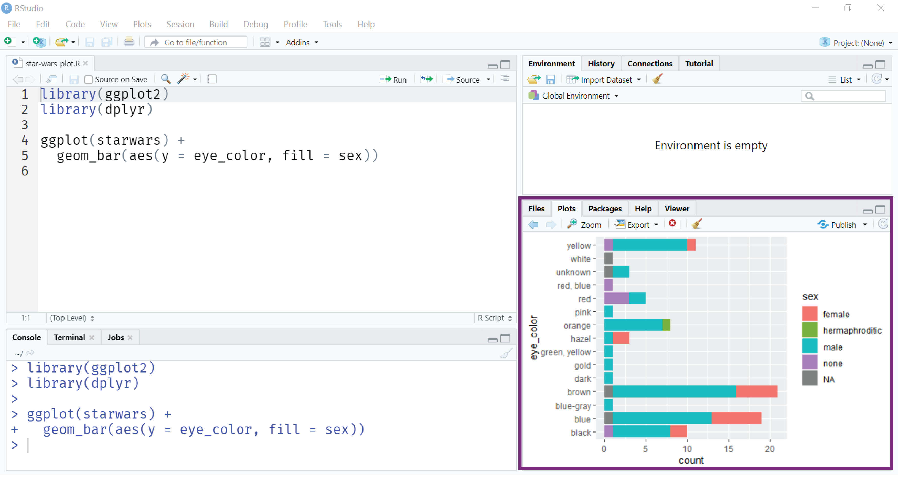
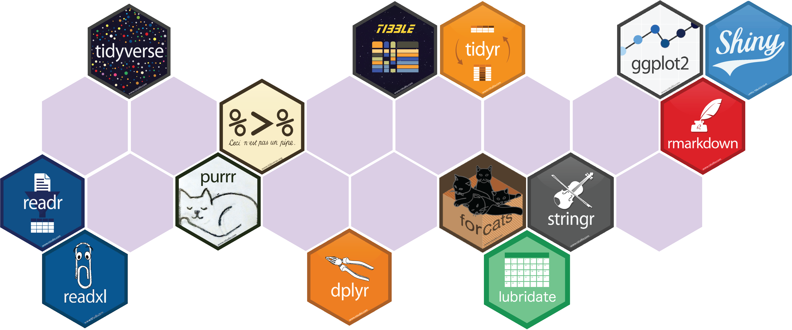

# Olá!

- Engenheira Ambiental (UFC)

--

- Mestre em Eng. Civil (Recursos Hídricos)

--

- Estudante de doutorado em Eng. Civil (Recursos Hídricos)

---

# Quem somos?

.pull-left[
[**R-Ladies**](https://rladies.org) é uma organização mundial que visa promover a diversidade de gênero na comunidade R.

Fundada pela [Gabriela de Queiroz](https://k-roz.com/) em 2012. O primeiro encontro foi em São Francisco (EUA).


]
.pull-right[
```{r echo = FALSE, out.width = "70%", fig.align = "center"}
knitr::include_graphics("img/rladies-hor.png")
```
]

---

# R-Ladies

```{r echo = FALSE, out.width = "80%", fig.align = "center"}

```

.center[
Esse é o primeiro encontro do capítulo de Fortaleza `r emo::ji("partying_face")`
]

---

# A linguagem R

### Por que R?

- Open source

--

- Comunidade colaborativa

--

- Grande disponibilidade de pacotes e ferramentas

---

# A linguagem R

### Comunidade R e onde tirar dúvidas

- Twitter **#rstats**

- Google (sério!)

- [Stack Overflow](https://pt.stackoverflow.com/questions/tagged/r) (fique atentx às regras da comunidade!)

---

# Visualização de dados

- Temperatura máxima em Fortaleza
  
```{r echo = FALSE, out.width = "70%", fig.align = "center"}

```

---

# Visualização de dados

- Demanda residencial de água
  
```{r echo = FALSE, out.width = "90%", fig.align = "center"}

```

---

# Visualização de dados

```{r echo = FALSE, out.width = "100%", fig.align = "center"}

```
.center[
[Fonte](http://www.interhacktives.com/2020/03/09/how-to-create-bbc-style-graphics-with-r-a-bbplot-tutorial/)]

---

# Visualização de dados

- Mapa temático
  
```{r echo = FALSE, out.width = "70%", fig.align = "center"}
knitr::include_graphics("img/bivariate-map.png")
```
.center[
Tutorial [aqui](https://timogrossenbacher.ch/2019/04/bivariate-maps-with-ggplot2-and-sf/)
]

---

# A linguagem R

### Algumas aplicações

- [Jornalismo de dados](https://www.curso-de-programacao-em-r-para-jornalistas.com/)

- [Ecologia](https://esajournals.onlinelibrary.wiley.com/doi/full/10.1002/ecs2.1394)

- [Processamento de linguagem natural](https://www.kaggle.com/rtatman/nlp-in-r-topic-modelling)
  - [Análise de clássicos da literatura brasileira](http://sillasgonzaga.com/post/literaturabr-01/) - Sillas Gonzaga

- Análise de dados

  - [Analisando o seu histórico da Netflix](https://www.curso-r.com/blog/2019-06-05-netflix) - William Amorim | Curso-R

- Criação de dashboards, relatórios, livros

  - [R-Ladies](https://benubah.github.io/r-community-explorer/rladies.html)
  
  - [Despesas com educação x IDEB](https://analise-siconfi-ideb.tesouro.gov.br) - Fernando Barbalho

---

# Primeiros passos: instalação

- Instale o **R** a partir do [CRAN](https://cran.r-project.org/)

--

- Baixe o **RStudio** [aqui](https://www.rstudio.com/products/rstudio/download/)

O **RStudio** é o IDE (Integrated Development Environment) da linguagem R.

---

# O ambiente do RStudio

```{r echo = FALSE, out.width = "90%", fig.align = "center"}

```

---

# O ambiente do RStudio

### Editor

```{r echo = FALSE, out.width = "90%", fig.align = "center"}

```

---

# O ambiente do RStudio

### Console

```{r echo = FALSE, out.width = "90%", fig.align = "center"}

```

---

# O ambiente do RStudio

### Environment

```{r echo = FALSE, out.width = "90%", fig.align = "center"}

```

---

# O ambiente do RStudio

### Output 

```{r echo = FALSE, out.width = "90%", fig.align = "center"}

```

---

# Tipos de variáveis

### Numéricas e inteiros

```{r message = FALSE}
a <- 2
b <- 1.5
c <- 3L

class(a)
class(b)
class(c)
```

---

# Tipos de variáveis

### Caracteres

```{r message = FALSE}
letra <- "R"
mensagem <- "Bem-vindas ao R-Ladies Fortaleza!"
class(letra)
class(mensagem)
```

---

# Tipos de variáveis

### Valores lógicos

.pull-left[
```{r message = FALSE}
c <- TRUE
d <- FALSE
class(c)
a <- 2
b <- 1.5
b > 6
```
]

.pull-right[
```{r message = FALSE}
a == b
a != b  #operador "diferente"
b > 6 & b <= 2  #operador E
b > 6 | a > 1   #operador OU
```
]
---

### Operadores aritméticos

```{r message = FALSE}
a + b   #soma
a - b   #subtração
a / b   #divisão
a * b   #multiplicação
a ^ b   #potenciação
```

---

# Estruturas de dados

### Vetores

```{r message = FALSE}
custo_produtos <- c(15.50, 20.70, 13.20, 14, 19.30)
class(custo_produtos)
1:6
cod_produtos <- c("A1", "B2", "A3", "A4", "B5")
class(cod_produtos)
```

---

# Operações com vetores

.pull-left[
```{r message = FALSE}
length(custo_produtos)
custo_produtos[1]
custo_produtos[-1]
custo_produtos[c(1, 3, 5)]
aumento <- 1.1
custo_produtos * aumento
```
]

.pull-right[
```{r message = FALSE}
custo_produtos + 5
custo_produtos < 19
custo_produtos[custo_produtos < 19]
custo_produtos[c(TRUE, FALSE, TRUE, TRUE, FALSE)]
```
]

---

# Estruturas de dados

### Dataframes

```{r}
lista_produtos <- data.frame(custo_produtos, cod_produtos)
lista_produtos
```

---

# Estruturas de dados

### Dataframes

.pull-left[
```{r}
nrow(lista_produtos)
ncol(lista_produtos)
colnames(lista_produtos)
rownames(lista_produtos)
```
]

.pull-right[
```{r}
# acessar coluna 
# "custo_produtos"
lista_produtos["custo_produtos"]

# outra forma de acessar 
# a coluna "custo_produtos"
lista_produtos$custo_produtos

```

]
---

# Funções

```{r message = FALSE}
custo_produtos
max(custo_produtos)
mean(custo_produtos)
num <- 15.78364
round(x = num, digits = 2)
```

---

# Tidyverse

```{r echo = FALSE, out.width = "100%", fig.align = "center"}

```

```{r echo = TRUE, eval = FALSE}
install.packages("tidyverse")
library(tidyverse)
```

.center[
[**Documentação do Tidyverse**](https://www.tidyverse.org/)
]
---

# O operador pipe %>%

.pull-left[
```{r, echo = FALSE}
library(magrittr)
```

```{r}
custo_produtos

mean(custo_produtos)
custo_produtos %>% mean()
```

Atalho para usar o %>%: 

`ctrl + shift + M`
]

.pull-right[
```{r echo = FALSE, out.width = "50%", fig.align = "center"}
knitr::include_graphics("img/pipe.png")
```
]

---

# Pacote dplyr

```{r echo = TRUE, eval = FALSE}
install.packages("dplyr")
library(dplyr)
```

#### Base de dados: starwars

```{r, echo = FALSE, message = FALSE}
library(dplyr)
starwars
```

---

# Funções do pacote dplyr

#### Selecionar variáveis: select

```{r}
library(dplyr)
starwars %>%
  select(name, height, mass) #<<
```

---

# Funções do pacote dplyr

#### Criar, modificar e deletar colunas: mutate

```{r}
starwars %>%
  select(name, height, mass) %>%
  mutate(imc = mass/height^2) #<<
```

---

# Funções do pacote dplyr

#### Escolher observações com base nos seus valores: filter

```{r}
starwars %>%
  select(name, species, height, mass) %>%
  filter(species == "Human") %>% #<<
  mutate(imc = mass/height^2)
```

---

# Funções do pacote dplyr

#### Escolher observações com base nos seus valores: filter

```{r}
starwars %>%
  select(name, species, height, mass) %>%
  filter(mass > 100 & height > 110) %>% #<<
  mutate(imc = mass/height^2)
```

---

# Funções do pacote dplyr

#### Agrupar e resumir valores: group_by e summarise

```{r}
starwars %>%
  select(name, species, gender, height, mass) %>%
  filter(species == "Human") %>%
  mutate(imc = mass/height^2) %>%
  group_by(gender) %>% #<<
  summarise(mean = mean(imc, na.rm = T)) #<<
```

---

# Funções do pacote dplyr

#### Mudar a ordem das linhas: arrange

```{r}
starwars %>%
  select(name, species, gender, height, mass) %>%
  filter(species == "Human") %>%
  arrange(desc(height)) #<<
```

---

# Funções do pacote dplyr

#### Mudar a ordem das linhas: arrange

```{r}
starwars %>%
  select(name, species, gender, height, mass) %>%
  filter(species == "Human") %>%
  group_by(gender) %>% #<<
  arrange(desc(height), .by_group = TRUE) #<<
```

---

# Tipos de união: inner join

.pull-left[
```{r}
band_members

band_members %>% 
  inner_join(band_instruments)
```
]

.pull-right[
```{r}
band_instruments
```

```{r, echo = FALSE, out.width = "80%", fig.align = "center"}
knitr::include_graphics("https://raw.githubusercontent.com/gadenbuie/tidyexplain/master/images/inner-join.gif")
```
]

---

# Tipos de união: left join

.pull-left[
```{r}
band_members

band_members %>% 
  left_join(band_instruments)
```
]

.pull-right[
```{r}
band_instruments
```

```{r echo = FALSE, out.width = "80%", fig.align = "center"}
knitr::include_graphics("https://raw.githubusercontent.com/gadenbuie/tidyexplain/master/images/left-join.gif")
```
]

---

# Tipos de união: right join


.pull-left[
```{r}
band_members

band_members %>% 
  right_join(band_instruments)
```
]

.pull-right[
```{r}
band_instruments
```

```{r echo = FALSE, out.width = "80%", fig.align = "center"}
knitr::include_graphics("https://raw.githubusercontent.com/gadenbuie/tidyexplain/master/images/right-join.gif")
```
]

---

# Tipos de união: full join

.pull-left[
```{r}
band_members

band_members %>% 
  full_join(band_instruments)
```
]

.pull-right[
```{r}
band_instruments
```

```{r, echo = FALSE, out.width = "80%", fig.align = "center"}
knitr::include_graphics("https://raw.githubusercontent.com/gadenbuie/tidyexplain/master/images/full-join.gif")
```
]

---

# Trabalhando com dados reais

- Base de dados: Educação (Ensino Fundamental)

[IPECE](http://ipecedata.ipece.ce.gov.br/ipece-data-web/) - Instituto de pesquisa e estratégia econômica do Ceará

--

```{r echo = FALSE, message = FALSE}
library(knitr)
library(kableExtra)
library(readr)

dados_ens_fund <- read_delim("data/data_ens_fundamental.csv",
                   delim = ";")
knitr::kable(head(dados_ens_fund, 50), format = "html") %>%
  kable_styling(font_size = 12) %>%
  scroll_box(width = "100%", height = "300px")
```

---

# Preparação dos dados

```{r message = FALSE}
library(readr)

dados_ens_fund <- read_delim("data/data_ens_fundamental.csv",
                   delim = ";")

colnames(dados_ens_fund)
```

---

# Preparação dos dados

```{r message = FALSE}
library(janitor)

dados_ens_fund <- read_delim("data/data_ens_fundamental.csv",
                   delim = ";") %>%
  janitor::clean_names() #<<

colnames(dados_ens_fund)
```

---

# Preparação dos dados

```{r message = FALSE}
library(dplyr)

dados_ens_fund <- read_delim("data/data_ens_fundamental.csv",
                   delim = ";") %>%
  janitor::clean_names() %>%
  select(c("ano", "nome_curto_indicador",                #<<
           "regiao_planejamento", "municipio", "valor")) #<<

head(dados_ens_fund, 5)
```

---

# Preparação dos dados

```{r message = FALSE}
dados_ens_fund <- read_delim("data/data_ens_fundamental.csv",
                   delim = ";") %>%
  janitor::clean_names() %>%
  select(c("ano", "nome_curto_indicador",
           "regiao_planejamento", "municipio", "valor")) %>%
  filter(regiao_planejamento == "Grande Fortaleza",                         #<<
         nome_curto_indicador == "Taxa de distorção idade/série no ensino fundamental") #<<

head(dados_ens_fund, 5)
```

---

# Visualização dos dados

.pull-left[
```{r plot-heatmap, fig.show = "hide", fig.retina = 4}
library(ggplot2)

ggplot(data = dados_ens_fund,
       aes(x = ano, y = municipio, fill = valor)) +
  geom_tile() +
    labs(title = "Taxa de distorção idade/série no Ens. fundamental",
       y = NULL, x = NULL) +
  theme_minimal() +
  theme(axis.text.x = element_text(angle = 90)) +
  scale_fill_distiller(palette = "RdYlBu") +
  scale_x_continuous(breaks = c(2007:2018),
                     labels = c(2007:2018))
```
]

.pull-right[
`)
]

---

# Para aprender mais

### Cursos e tutoriais

- [Introduction to R](https://tinystats.github.io/teacups-giraffes-and-statistics/01_introToR.html)

- [R bootcamp](https://r-bootcamp.netlify.app/)

- Pacote [swirl](https://swirlstats.com/)

```{r echo = TRUE, eval = FALSE}
  install.packages("swirl")
  library(swirl)
  swirl()
```

--

### Livros

- Livro da [Curso-R](https://livro.curso-r.com/index.html)

- [An introduction to statistical learning](http://faculty.marshall.usc.edu/gareth-james/ISL/)

- [R for Data Science](https://r4ds.had.co.nz/) - Hadley Wickham & Garrett Grolemund

---

class: center, middle

# Obrigada!

Slides criados com o pacote [xaringan](https://github.com/yihui/xaringan)

Agradecimentos a [Beatriz Milz](https://github.com/beatrizmilz) pelo [curso de xaringan](https://github.com/beatrizmilz/aMostra-IME-2019-Xaringan)

Gifs do tidyverse criados por [Garrick Aden‑Buie](https://www.garrickadenbuie.com/project/tidyexplain/)

```{r echo = FALSE, out.width = "50%", fig.align = "center"}
knitr::include_graphics("img/rladies-hor.png")
```